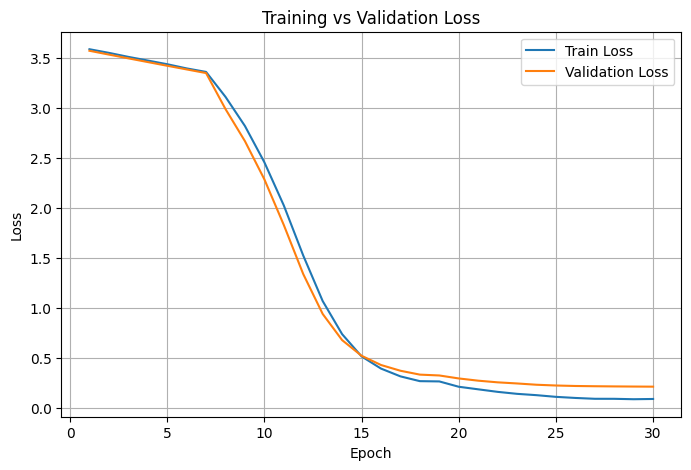
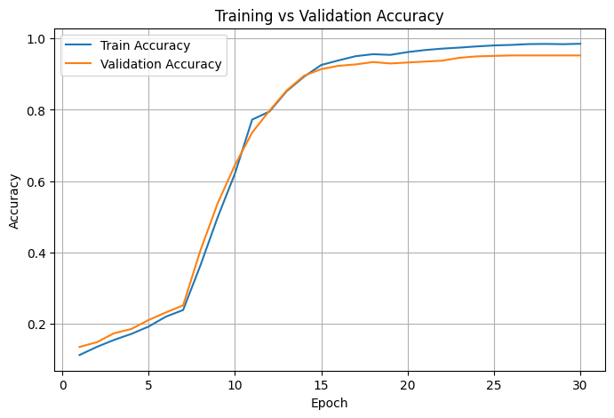
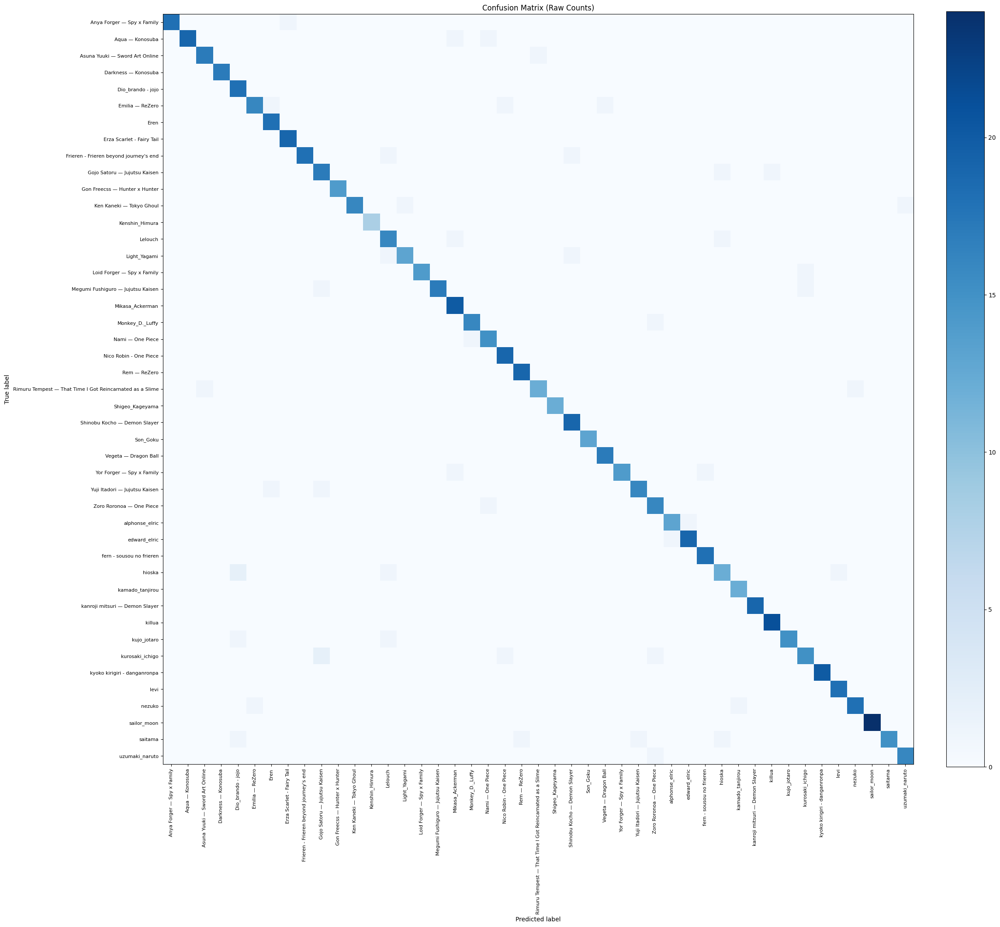
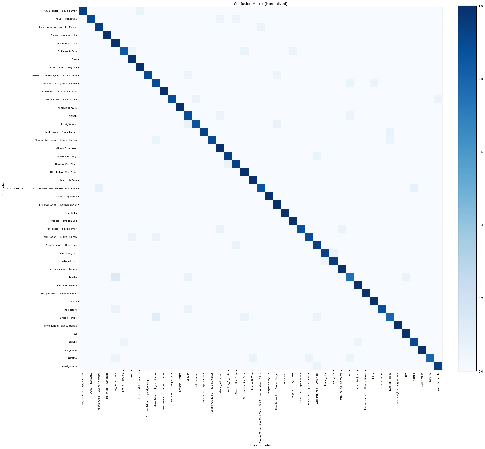
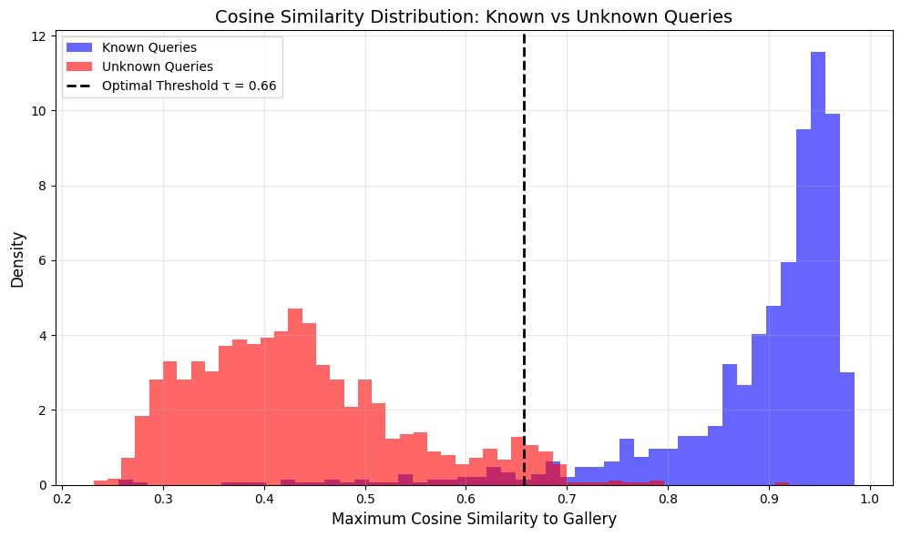
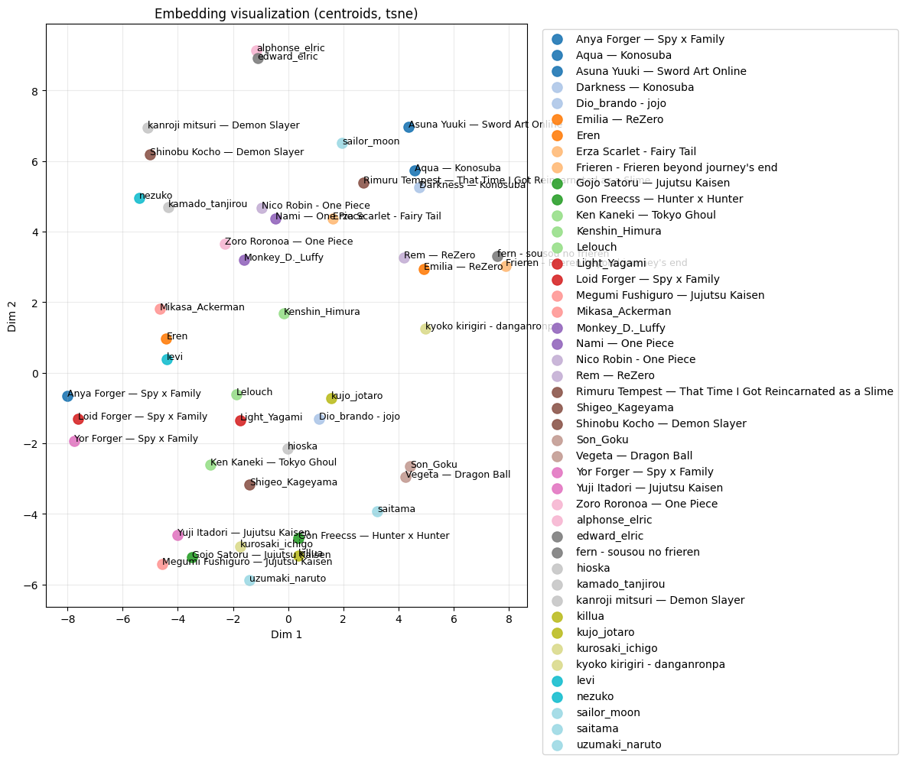
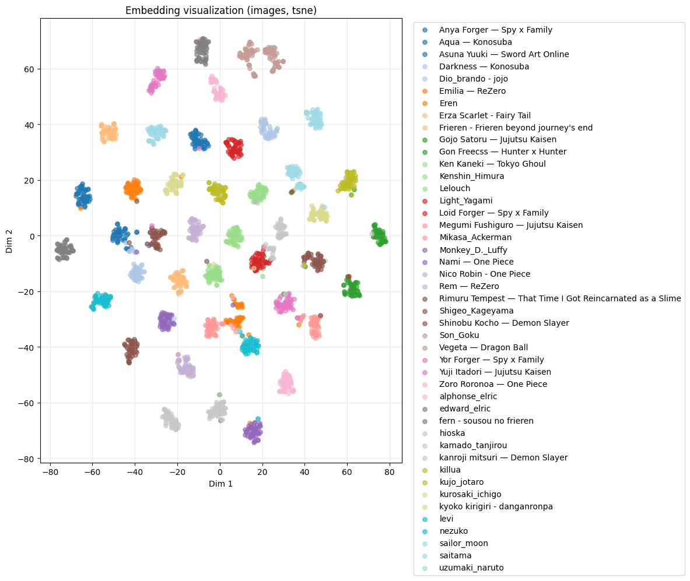

# Machine Learning Project

## Mô Tả Bài Toán

Dự án này nhằm giải quyết bài toán nhận diện nhân vật anime bằng cách sử dụng các mô hình học máy hiện đại.

### Mục Tiêu Chính
- Xây dựng và huấn luyện mô hình dự đoán/phân loại
- Đạt được độ chính xác cao trên tập dữ liệu
- Cải tiến mô hình và hỗ trợ nhận diện các nhân vật mới
### Pipeline

## Dataset

Bộ dữ liệu sử dụng trong dự án này có thể được tải xuống từ:

📊 **[Google Drive Dataset Link](https://drive.google.com/drive/folders/1gz-vo-YugcGh2BVRxsV1SfOOJ-CidT0Z?usp=sharing)**

### Cấu Trúc Dataset
- **Số lượng mẫu**: 7760 bức ảnh tổng thể trong đó, số lượng ảnh trong thư mục train: 6219 - Số lượng ảnh trong thư mục val: 755 - Số lượng ảnh trong thư mục test: 786
- **Nhãn/Classes**: 45 classes

## Cấu Trúc Dự Án

```
.
├── README.md                # Tài liệu dự án
├── main.ipynb               # Notebook chính: preprocessing, training, evaluation
├── outputs/                 # Ảnh kết quả, biểu đồ, đánh giá
├── embeddings/              # Embedding/gallery đã trích xuất
└── checkpoints/             # Mô hình đã huấn luyện
```

## Yêu Cầu Môi Trường

- Python 3.9+ (khuyến nghị 3.10)
- pip
- (Tùy chọn) môi trường ảo: venv/conda

Thiết lập nhanh (venv):

```bash
python -m venv .venv
source .venv/bin/activate  # Windows: .venv\Scripts\activate
pip install -r requirements.txt
```

Các thư viện chính:
- pandas
- numpy
- scikit-learn
- torch (PyTorch)
- matplotlib / seaborn

## Hướng Dẫn Sử Dụng

1. Tải dataset từ link Google Drive
2. Chạy các cell trong `main.ipynb` theo thứ tự
3. Mô hình sẽ được lưu vào `saved_model/best_vit_model.pth`

## Kết Quả
### Pretrained Backbone và so sánh với Baseline model

Chúng tôi sử dụng SmilingWolf/wd-vit-tagger-v3 làm pretrained backbone
thay vì baseline để so sánh, do sự khác biệt về domain và objective giữa hai task:

- Model gốc được thiết kế cho general anime tagging trên ~10k class
- Model của chúng tôi được fine-tune cho identity recognition
  trên 45 nhân vật cụ thể với open-set capability

Việc so sánh accuracy trực tiếp sẽ không phản ánh đúng bản chất
của hai bài toán. Thay vào đó, chúng tôi đánh giá hiệu quả của
transfer learning từ backbone pretrained sang task cụ thể.
- **Đường cong học ( epochs)**: loss giảm dần (train/val ~3.58 -> ~0.23), accuracy tăng dần (train ~0.11 -> ~0.95, val ~0.14 -> ~0.93).
- **Confusion matrix**: đường chéo đậm rõ, đa số lớp được nhận đúng; một số lớp nhầm lẫn nhẹ ở ngoài đường chéo.
- **Phân tách known/unknown**: phân bố cosine similarity tách biệt rõ; ngưỡng tối ưu $\tau$ ~0.66 để loại UNKNOWN.
- **Suy luận mẫu**: các truy vấn minh họa cho thấy dự đoán đúng với độ tin cậy cao cho lớp known, UNKNOWN cho trường hợp ngoài lớp.
















Ghi chú: các biểu đồ loss/accuracy, confusion matrix, và phân bố cosine similarity được vẽ trong main.ipynb.

Nhận xét:
- **Tổng quan**: Pipeline có tính hợp lý cho bài toán nhận diện nhân vật anime (ViT + fine-tune + embedding gallery + open-set gate). Các biểu đồ cho thấy mô hình đã học được biểu diễn có nghĩa.
- **Độ phân tách lớp**: Confusion matrix tập trung trên đường chéo, và embedding visualization có xu hướng gom cụm theo lớp -> khả năng phân biệt tốt giữa các nhân vật chính.
- **Open-set**: Histogram cosine similarity cho thấy có khoảng tách giữa known và unknown, phù hợp với cơ chế ngưỡng $\tau$ để từ chối nhân vật lạ.
- **Dấu hiệu cần cải thiện**: Đường cong học vẫn tăng chậm và chưa hội tụ rõ ràng -> cần thêm dữ liệu, tăng epochs hợp lý, hoặc điều chỉnh learning rate/regularization.
- **Rủi ro**: Mô hình có thể nhạy cảm với ảnh bị che mặt, góc mặt lạ, hoặc nhiều nhân vật có thiết kế giống nhau; cần đánh giá thêm trên tập test thực tế đa dạng.
- **Khuyến nghị**: Thử tiền xử lý ổn định (face detect + align), bổ sung augmentations, và báo cáo thêm chỉ số macro-F1/Top-1 trên tập test độc lập.

## Tác Giả

Nguyễn Tấn Phúc Thịnh - 24521696

## Ghi Chú

Mở rộng để nhận diện các nhân vật anime mới và triển khai lên Hugging Face

REFACTOR LẠI TOÀN BỘ REPO

THÊM CONFIG FILE (YAML/JSON) cho hyperparameters

REEVALUATE LỖI SAI THẬT KỸ

THÊM LICENSE

class_names.txt nên nằm ở data/ hoặc assets/

Thêm randomseed

Thêm slide powerpoint để giới thiệu cụ thể chủ đề

Một Makefile hoặc run.sh chạy được từ đầu đến cuối

Thêm error analysis 