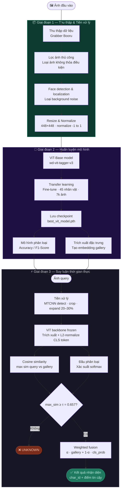

# Machine Learning Project

## Mô Tả Bài Toán

Dự án này nhằm giải quyết bài toán nhân diện nhân vật anime bằng cách sử dụng các mô hình học máy hiện đại. 

### Mục Tiêu Chính
- Xây dựng và huấn luyện mô hình dự đoán/phân loại
- Đạt được độ chính xác cao trên tập dữ liệu
- [Thêm mục tiêu cụ thể khác của bạn]
### Pipeline

## Dataset

Bộ dữ liệu sử dụng trong dự án này có thể được tải xuống từ:

📊 **[Google Drive Dataset Link](https://drive.google.com/drive/folders/1gz-vo-YugcGh2BVRxsV1SfOOJ-CidT0Z?usp=sharing)**

### Cấu Trúc Dataset
- **Số lượng mẫu**: [X samples]
- **Số lượng feature**: [Y features]
- **Nhãn/Classes**: [Mô tả nhãn]

## Cấu Trúc Dự Án

```
.
├── README.md              # Tài liệu dự án
├── main.ipynb             # Notebook chính - preprocessing, training, evaluation
├── model.pth              # Mô hình đã huấn luyện
└── [Thêm thư mục khác]
```

## Yêu Cầu Môi Trường

```bash
pip install -r requirements.txt
```

Các thư viện chính:
- pandas
- numpy
- scikit-learn
- torch (PyTorch)
- matplotlib / seaborn

## Hướng Dẫn Sử Dụng

1. Tải dataset từ link Google Drive
2. Chạy các cell trong `main.ipynb` theo thứ tự
3. Mô hình sẽ được lưu vào `model.pth`

## Kết Quả

[Thêm kết quả huấn luyện - metrics, accuracy, loss, v.v.]

## Tác Giả


## Ghi Chú

[Thêm bất kỳ ghi chú hoặc hướng phát triển trong tương lai]
